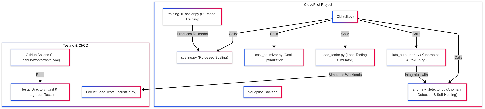

# CloudPilot

CloudPilot is an AI-driven infrastructure optimizer designed to continuously learn and adapt, helping organizations reduce cloud costs while maintaining optimal performance, reliability, and scalability. It combines advanced machine learning techniques with cloud and Kubernetes management tools to automate scaling, cost optimization, anomaly detection, and load testing.

<p align="center" width="100%">

</p>

## Key Features

- **Intelligent Scaling:**  
  Uses a hybrid approach (heuristics with reinforcement learning) to dynamically adjust auto-scaling policies based on real-world workload patterns.
- **Cost Optimization:**  
  Retrieves real-time AWS pricing data to suggest cost-efficient instance types, with future plans to support GCP and Azure.
- **Kubernetes Auto-Tuning:**  
  Automatically adjusts Kubernetes deployments by tuning resource limits (CPU/memory) and checking for anomalies.
- **Anomaly Detection & Self-Healing:**  
  Monitors system metrics from Prometheus and Kubernetes logs to detect anomalies using unsupervised models (Isolation Forest), and triggers self-healing actions like restarting failing pods.
- **Smart Load Testing Simulator:**  
  Simulates realistic workload patterns using probabilistic modeling (Poisson processes) to stress test your infrastructure, with plans to incorporate AI-driven load pattern generation.

## Tech Stack

- **Language:** Python
- **ML Frameworks:** PyTorch, Scikit-Learn
- **Cloud Integration:** Boto3 (AWS)
- **Container Orchestration:** Kubernetes
- **Monitoring:** Prometheus, Grafana
- **Load Testing:** Locust
- **CI/CD:** GitHub Actions

## Project Structure

```plaintext
CloudPilot/
├── cloudpilot/
│   ├── __init__.py
│   ├── anomaly_detector.py
│   ├── cost_optimizer.py
│   ├── k8s_autotuner.py
│   ├── load_tester.py
│   ├── scaling.py
│   └── training_rl_scaler.py
├── cli.py
├── locustfile.py
├── tests/
│   ├── test_anomaly_detector.py
│   ├── test_cli.py
│   ├── test_cost_optimizer.py
│   ├── test_integration.py
│   ├── test_k8s_autotuner.py
│   ├── test_load_tester.py
│   └── test_scaling.py
├── .github/
│   └── workflows/
│       └── ci.yml
├── requirements.txt
├── README.md
└── CONTRIBUTING.md
```

## Installation

1. **Clone the repository:**

```bash
git clone https://github.com/yourusername/CloudPilot.git
cd CloudPilot
```

2. **Install dependencies:**

```bash
pip install -r requirements.txt
```

3. **(Optional) Install Locust for load testing:**

```bash
pip install locust
```

## Usage

### Command-Line Interface (CLI)

CloudPilot provides a CLI tool to access core functionalities.

- **Scaling Recommendation:**

```bash
python cli.py scale --cpu 80 --mem 70 --req 0.8 --latency 100 --demand 0.9
```

- **Cost Optimization:**

```bash
python cli.py cost --instance-type m5.large
```

- **Kubernetes Auto-Tuning:**

```bash
python cli.py tune --deployment your-deployment --namespace default
```

- **Display Version:**

```bash
python cli.py --version
```

### Load Testing with Locust

To run the load testing simulation:

```bash
locust -f locustfile.py
```

Then open the Locust web UI in your browser to start the test.

## Testing

Run unit, integration, and end-to-end tests using pytest:

```bash
py -m pytest
```

Your GitHub Actions workflow also runs tests on every commit.

## Roadmap

- Expand RL training with real workload data.
- Integrate full multi-cloud cost optimization (GCP, Azure).
- Enhance anomaly detection using LSTMs or autoencoders.
- Build a lightweight web dashboard for non-expert users.
- Expand load testing features and incorporate external tools (e.g., stress-ng).

## Contributing

Contributions are welcome! Please see CONTRIBUTING.md for guidelines on how to help improve CloudPilot.

## License

This project is licensed under the MIT License. See the LICENSE file for details.
