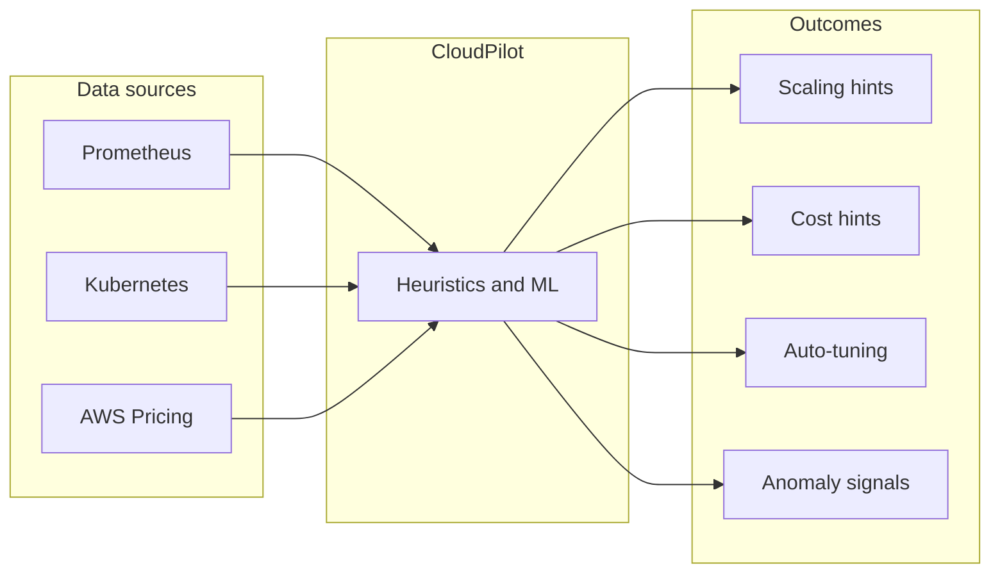

<h1 align="center">CloudPilot</h1>

<p align="center">
  <strong>ML-assisted signals for scaling, cost, and Kubernetes operations</strong>
</p>

<p align="center">
  <a href="https://www.python.org/downloads/"></a>
  <a href="LICENSE"></a>
  
  
  
</p>

<p align="center">
  <a href="#quick-start">Quick start</a>
  &nbsp;·&nbsp;
  <a href="#features">Features</a>
  &nbsp;·&nbsp;
  <a href="#configuration">Configuration</a>
  &nbsp;·&nbsp;
  <a href="CONTRIBUTING.md">Contributing</a>
  &nbsp;·&nbsp;
  <a href="LICENSE">License</a>
</p>

---

CloudPilot connects **Prometheus metrics**, **Kubernetes**, and **AWS pricing data** to a small set of Python modules that recommend scaling actions, surface cost-oriented hints, tune deployment CPU limits, and flag anomalies. It is built for operators and engineers who want **transparent defaults**, **testable behavior**, and **explicit guardrails** when automation touches production clusters.


```mermaid
flowchart LR
  subgraph signals [Data sources]
    PR[Prometheus]
    K8[Kubernetes]
    AW[AWS Pricing]
  end
  subgraph core [CloudPilot]
    CP[Heuristics and ML]
  end
  subgraph out [Outcomes]
    SC[Scaling hints]
    CO[Cost hints]
    TU[Auto-tuning]
    AN[Anomaly signals]
  end
  PR --> CP
  K8 --> CP
  AW --> CP
  CP --> SC
  CP --> CO
  CP --> TU
  CP --> AN
```

---

## Table of contents

| | |
|--|--|
| [Quick start](#quick-start) | Clone, environment, and first install |
| [Features](#features) | What the toolkit does |
| [Tech stack](#tech-stack) | Languages, libraries, and CI |
| [Requirements](#requirements) | What you need before running |
| [Project layout](#project-layout) | Repository map |
| [Installation](#installation) | Extras, `uv`, and Locust |
| [Configuration](#configuration) | Environment variables |
| [Usage](#usage) | CLI and Locust |
| [Machine learning artifacts](#machine-learning-artifacts) | Models and training |
| [AWS and Kubernetes notes](#aws-and-kubernetes-notes) | Integration details |
| [Testing and quality](#testing-and-quality) | Pytest, coverage, audits |
| [Roadmap](#roadmap) | Planned direction |
| [Contributing](#contributing) | How to help |
| [License](#license) | Legal |

---

## Quick start

```bash
git clone https://github.com/<your-org-or-username>/cloudpilot.git
cd cloudpilot
python -m venv .venv && source .venv/bin/activate   # Windows: .venv\Scripts\Activate.ps1
python -m pip install --upgrade pip
pip install -e ".[dev,ml]" --extra-index-url https://download.pytorch.org/whl/cpu
pytest
cloudpilot --version
```

Runtime-only install (includes optional PyTorch for scripted scaling): `pip install -e ".[ml]"`.

---

## Features

| Capability | What you get |
|------------|----------------|
| **Scaling intelligence** | TorchScript inference when a model is available; otherwise a safe, deterministic fallback. |
| **Cost awareness** | EC2 pricing lookups via the AWS Price List API, returned as concise guidance. |
| **Kubernetes tuning** | Heuristic CPU limit adjustments with an optional **dry-run** that skips API patches. |
| **Anomaly detection** | Isolation Forest over metric features; model training is **lazy** (not at import time). |
| **Self-healing** | Pod restarts only when **explicitly confirmed** through configuration—never by default. |
| **Load simulation** | Poisson-style request timing and a stress-test placeholder for experimentation. |

---

## Tech stack

| Layer | Details |
|-------|---------|
| **Runtime** | Python 3.10+ ([`pyproject.toml`](pyproject.toml)) |
| **Machine learning** | scikit-learn; PyTorch via optional [`ml`](pyproject.toml) extra |
| **Cloud & orchestration** | boto3, official Kubernetes client |
| **Observability** | prometheus-api-client |
| **Optional load tests** | Locust ([`locustfile.py`](locustfile.py)) |
| **Quality gates** | Ruff, Mypy, Bandit, pip-audit, pytest, coverage |
| **Continuous integration** | GitHub Actions on 3.10, 3.11, 3.12 ([`.github/workflows/ci.yml`](.github/workflows/ci.yml)) |

---

## Requirements

- **Python** 3.10 or newer.
- **AWS** (for pricing): credentials or role available to boto3 (for example standard environment variables or instance metadata).
- **Kubernetes** (for live tuning or self-heal): a valid kubeconfig and cluster reachability—omit if you only run the test suite with mocks.

---

## Project layout

```text
.
├── cloudpilot/                 # Main package (PEP 561: py.typed)
│   ├── config.py               # Central env-based settings
│   ├── scaling.py
│   ├── cost_optimizer.py
│   ├── k8s_autotuner.py
│   ├── anomaly_detector.py
│   ├── load_tester.py
│   └── training_rl_scaler.py
├── tests/
├── cli.py                      # Same entry as console script `cloudpilot`
├── locustfile.py
├── pyproject.toml
├── uv.lock
├── .github/workflows/ci.yml
├── CONTRIBUTING.md
├── LICENSE
└── README.md
```

---

## Installation

**1. Clone** (use your fork or upstream URL).

```bash
git clone https://github.com/<your-org-or-username>/cloudpilot.git
cd cloudpilot
```

**2. Virtual environment** (recommended).

```bash
python -m venv .venv
source .venv/bin/activate          # Linux / macOS
# .venv\Scripts\activate.bat       # Windows cmd
# .venv\Scripts\Activate.ps1       # Windows PowerShell
```

**3. Install** one of the following.

| Goal | Command |
|------|---------|
| Application + ML extra | `pip install -e ".[ml]"` |
| Full developer + ML (matches CI toolset) | `pip install -e ".[dev,ml]" --extra-index-url https://download.pytorch.org/whl/cpu` |

The CPU PyTorch index keeps wheels smaller on Linux, macOS, and typical CI images. For **CUDA** builds, drop the extra index and install the wheel set that matches your platform.

**Reproducible installs with uv**

```bash
uv sync --all-extras
```

The first resolve may pull a large PyTorch artifact when `ml` is included.

**Optional: Locust**

```bash
pip install locust
```

**Dependency extras** (declared under `[project.optional-dependencies]` in [`pyproject.toml`](pyproject.toml)):

| Extra | Includes |
|-------|-----------|
| `ml` | `torch>=2.0` for scripted scaling |
| `dev` | pytest, coverage, Ruff, Mypy, Bandit, pip-audit, types-PyYAML |

Combine with: `pip install -e ".[dev,ml]"`.

> **Note.** [`requirements.txt`](requirements.txt) documents install patterns only; it does not pin versions. Prefer `pyproject.toml` and, when using uv, [`uv.lock`](uv.lock).

---

## Configuration

All settings are read from the environment. Source of truth: [`cloudpilot/config.py`](cloudpilot/config.py).

| Variable | Default | Role |
|----------|---------|------|
| `CLOUDPILOT_PROMETHEUS_URL` | `http://localhost:9090` | Prometheus base URL |
| `CLOUDPILOT_PROMETHEUS_DISABLE_SSL` | `1` (truthy) | Skip TLS verification for Prometheus |
| `CLOUDPILOT_SELF_HEAL_CONFIRM` | unset | Must be `1`, `true`, `yes`, or `on` to allow destructive pod deletes in `self_heal` |
| `CLOUDPILOT_AWS_PRICING_REGION` | `us-east-1` | Region for the Pricing API client |
| `CLOUDPILOT_K8S_DRY_RUN` | unset | If truthy, tuning runs without patching the cluster |

> **Safety.** Pod deletion is **opt-in** by design. Without `CLOUDPILOT_SELF_HEAL_CONFIRM`, self-heal reports a skip instead of mutating the cluster.

---

## Usage

### CLI

The `cloudpilot` command (or `python cli.py`) exposes:

| Action | Example |
|--------|---------|
| Scaling recommendation | `cloudpilot scale --cpu 80 --mem 70 --req 0.8 --latency 100 --demand 0.9` |
| Cost hint | `cloudpilot cost --instance-type m5.large` |
| Deployment tuning | `cloudpilot tune --deployment your-deployment --namespace default` |
| Version | `cloudpilot --version` |

For `scale`, `--demand` must lie in **[0, 1]**.

### Locust

```bash
locust -f locustfile.py
```

Then open the Locust UI in your browser to control the scenario.

---

## Machine learning artifacts

- **Inference:** With `torch` installed, CloudPilot searches for `rl_scaling_model.pt` as packaged data under `cloudpilot/`, then on disk beside the package. Missing file or missing `torch` yields a stable heuristic outcome (`Maintain`).
- **Training a placeholder model:** With the `ml` extra: `python -m cloudpilot.training_rl_scaler` writes `rl_scaling_model.pt` in the working directory. Package or mount that file where your runtime expects it.

---

## AWS and Kubernetes notes

- **AWS:** Pricing filters target common Linux / shared-tenancy / regional product rows. Extend or change filters in code if you need other operating systems or commercial terms.
- **Kubernetes:** The client uses default kubeconfig discovery. Use `CLOUDPILOT_K8S_DRY_RUN` to exercise tuning logic without applying `patch_namespaced_deployment`.

---

## Testing and quality

Default pytest options **exclude** `@pytest.mark.integration` tests (see [`pyproject.toml`](pyproject.toml)).

```bash
pytest
```

CI-style run (coverage + JUnit):

```bash
pytest --junitxml=junit.xml -q --cov=cloudpilot --cov=cli --cov-report=xml --cov-report=term
```

Coverage enforces **`fail_under = 45`** when reporting is enabled.

```bash
pytest -m integration          # only integration-marked tests
py -m pytest                   # Windows launcher if `pytest` is not on PATH
```

**Security and supply chain** (also executed in CI):

```bash
bandit -r cloudpilot -c pyproject.toml
pip freeze > freeze.txt && pip-audit -r freeze.txt --desc on && rm freeze.txt
```

`freeze.txt` is gitignored—do not commit it.

---

## Roadmap

- RL training grounded in real workload history.
- Broader cloud pricing (GCP, Azure).
- Stronger anomaly models (for example sequence models or autoencoders).
- Operator-focused dashboard.
- Deeper integration with industrial load and stress tools.

---

## Contributing

Guidelines, hooks, and review expectations live in [**CONTRIBUTING.md**](CONTRIBUTING.md). Issues and pull requests are welcome.

---

## License

Released under the [**MIT License**](LICENSE).

Copyright (c) 2025 Matéo H. Petel.
